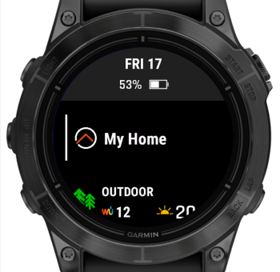
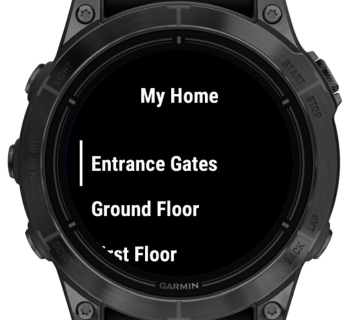
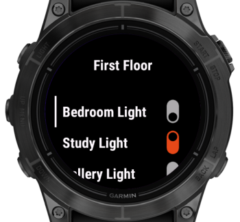
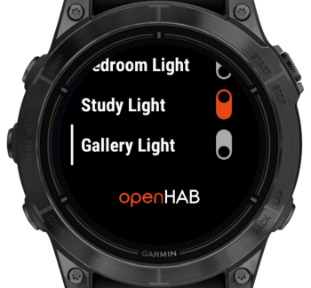
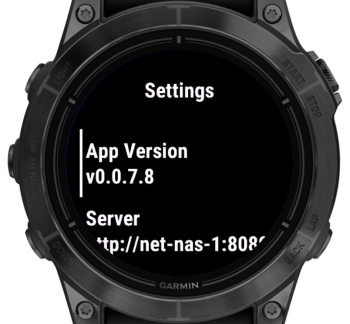

# openHAB for Garmin

**openHAB for Garmin** connects your Garmin wearable to your [openHAB](https://www.openhab.org) smart home system, giving you convenient access to essential devices and real-time information.

**Resources**

➡️ [Install on Garmin Connect IQ Store](https://apps.garmin.com/apps/93fd8044-1cf4-450c-b8aa-1c80a6730d1a)
➡️ [openHAB Community Discussion](https://community.openhab.org/t/openhab-for-garmin/163891)  
➡️ [Report Issues on GitHub](https://github.com/TheNinth7/ohg/issues)

**Development Status**

🚧 This app is in an **early stage of development**. Core features are available, and active development is ongoing.

---

# Table of Contents

[Connectivity](#-connectivity)

[Configuration](#-configuration)

[Using myopenHAB](#-using-myopenhab)

[Sitemap Setup](#-sitemap-setup)

[Settings View](#settings-view)

[Custom Webhook](#️-custom-webhook)

[Troubleshooting](#-troubleshooting)

[License](#-license)

[Iconography](#-iconography)

---

## Introduction

This app is built on the foundation of **openHAB sitemaps**, which define an interactive view of your openHAB model. A sitemap allows you to specify which devices are accessible through the app and how they are organized and presented.

The app consists of two components: the **Glance** and the **Widget**.
The **Glance** displays the name of the sitemap and acts as the entry point into the full-screen **Widget**, which shows the sitemap's content.

<table>
  <tr>
    <td width="50%"></td>
    <td></td>
  </tr>
</table>

Once opened, the **Widget** polls the sitemap at a configurable interval to fetch updates. Commands are sent to openHAB via its JSON-based REST API. If your openHAB setup does not support this API, you can alternatively configure a custom Webhook.

Inside the **Widget**, sitemap elements are displayed as **Sitemap Widgets**.
*Note: The term "widget" is used by both Garmin and openHAB to mean different things, which can be a source of confusion. In this manual, "Widget" refers to the Garmin app component, while "Sitemap Widget" refers to individual elements defined in the openHAB sitemap.*

The following sections provide detailed guidance on configuring the app, supported Sitemap Widgets, user interface behavior, and troubleshooting tips.

---

# Configuration

Once the app is installed, you can configure the following settings by opening it in the Garmin Connect IQ smartphone app.

| Setting             | Description |
|---------------------|-------------|
| **URL** | Your openHAB URL in the format `https://host:port` or `http://host:port`. Note: HTTP only works with iOS. See [Connectivity](#connectivity) and [Using myopenHAB](#-using-myopenhab) for details. |
| **Sitemap Name** | Name of the sitemap to display. See [Sitemap Setup](#-sitemap-setup) for details. | 
| **Native REST API Support** | Enable if your openHAB supports the new JSON-based REST API for sending commands. See [Sending Commands](#-sending-commands) for details. |
| **Webhook Identifier** | If your openHAB version doesn't support the JSON-based REST API (see above), you can configure a custom webhook to send commands. See [Custom Webhook](#custom-webhook) for details. |
| **Username** | For basic authentication (used for [myopenHAB](#-using-myopenhab), see below) |
| **Password** | Password for basic authentication |
| **Supress empty response errors** | Suppress errors for empty sitemap responses. Recommended when using myopenhab.org, which occasionally returns empty results. See the related [openhab-cloud issue #496](https://github.com/openhab/openhab-cloud/issues/496) for details. |
| **Polling Interval (ms)** | Interval between data requests to your openHAB instance. Set to 0 to fetch new data immediately after the previous response is processed. Polling only occurs while the app is open, not in the background. If you're using **myopenhab.org**, it's recommended to use the default (3000 ms) or a higher value to avoid overloading their servers. If you're connecting to your own openHAB server directly, you may try setting it to 0 for more responsive updates. |


---

## Connectivity

Garmin wearables rely on your smartphone for network access. If your phone can reach your openHAB instance (e.g. via local network or VPN like Tailscale), the watch can too.

**Platform-specific Limitations**
- **iOS**: HTTP and HTTPS supported  
- **Android**: Only HTTPS with a valid certificate is supported due to Garmin SDK limitations

You can use [myopenHAB](https://www.myopenhab.org) to securely access your local openHAB instance over the Internet using HTTPS.

---

## Using myopenHAB

To connect using [myopenHAB](https://myopenhab.org):

1. Install the [openHAB Cloud Connector](https://www.openhab.org/addons/integrations/openhabcloud/)
2. Register at [myopenhab.org](https://myopenhab.org)
3. Set the URL in the app to `https://home.myopenhab.org`
4. Use your myopenHAB username and password for authentication

---

## Sending Commands

Starting with openHAB 5, a built-in JSON-based REST API enables this app to send commands directly—no additional setup required.

For earlier versions (openHAB 4.x), you can either install a backported version of the API or configure a custom webhook.

### Option 1: Install the Backport

To enable JSON-based command support on openHAB 4.x, install the backported API bundle. Follow the instructions here:
➡️ [Backport Installation Guide](https://github.com/florian-h05/openhab-core/releases/tag/4.3.x-command-json)

### Option 2: Custom Webhook

If your openHAB setup does not support the JSON-based REST API for sending commands, you can configure a custom Webhook using the Webhook binding instead.

➡️ [Continue here](webhook.md) for setup instructions.

---

# Using the App

This section explains how to set up your openHAB sitemap for use with the app, outlines the supported Sitemap Widgets, and describes key aspects of the user interface.

---

## Sitemap Setup

Check the openHAB Sitemaps documentation to learn more about how sitemaps work.

➡️ [openHAB Sitemaps Documentation](https://www.openhab.org/docs/ui/sitemaps.html)

The sitemap name configured in the app must match the filename of the sitemap, excluding the `.sitemap` extension.

For example, if the file is named `garmin_demo.sitemap`, set the sitemap name in the app settings to `garmin_demo`.

The label defined within the sitemap file is displayed in the app UI, such as in glances and other views.

```xtend
sitemap garmin_demo label="My Home" {
}
```

---

### Supported Elements

The following element types are currently supported:

- [`Frame`](https://www.openhab.org/docs/ui/sitemaps.html#element-type-frame)

- [`Switch`](https://www.openhab.org/docs/ui/sitemaps.html#element-type-switch)

- [`Slider`](https://www.openhab.org/docs/ui/sitemaps.html#element-type-slider)

- [`Text`](https://www.openhab.org/docs/ui/sitemaps.html#element-type-text)

The following sections describe the supported parameters and the Sitemap Widget associated with each of these elements.

---

### `Frame`

The [`Frame`](https://www.openhab.org/docs/ui/sitemaps.html#element-type-frame) element is used to group other elements, helping to organize your Sitemap Widgets into a hierarchical structure.

The app presents the sitemap using a menu-based structure. The root of the sitemap corresponds to the app’s **home screen**. Each `Frame` is represented as its own **menu**, and `Frame` elements can be **nested** within other `Frames` to create submenus.

**Important:** The home screen and each `Frame` may contain either only `Frame` elements (i.e., submenus) or only non-`Frame` elements (`Switch`, `Slider`, `Text`, etc.). Mixing both types within the same `Frame` is not supported.

Here is an example of a sitemap containing three `Frame` elements.

```xtend
sitemap garmin_demo label="My Home" {
	Frame label="Entrance Gates" {
		Switch item=EntranceGatesTrigger label="Open/Close"
		Text item=EntranceGateStatus label="Status"
	}
	Frame label="Ground Floor" {
    // ...
	}
	Frame label="First Floor" {
    // ...
	}
}
```

This configuration produces the following display in the UI:

<table>
  <tr>
    <td width="50%"></td>
    <td></td>
  </tr>
</table>

---

### `Switch`

The [`Switch`](https://www.openhab.org/docs/ui/sitemaps.html#element-type-switch) Sitemap Widget shows the state of an item and allows the user to change that state.

The supported parameters are:
- `label`: shown on the UI
- `item`: the name of the associated openHAB item
- `mappings`: optional, to be used if different commands than `ON`/`OFF` shall be used to control the item.

If no mappings are provided, a toggle Switch is rendered and on selection ON/OFF commands will be sent.

If mappings are provided, the UI renders the current status as text. If the status equals one of the commands from the mappings, then the label defined there will be shown, otherwise the raw state. On selection, the behavior will differ depending on the number of commands and the current state.

- If one command is defined, it will be send immediately.
- If two commands are defined and one of them equals to the item state, than the other will be send immediatly.
- In all other cases, an action menu will be shown in the right of the screen, letting the user select from the list of available commands. If the current state equals one of the commands, that command will not be shown in the list.


This configuration produces the following display in the UI:
<table>
  <tr>
    <td width="50%"></td>
    <td></td>
  </tr>
  <tr>
    <td width="50%"></td>
    <td></td>
  </tr>
</table>


- [`Slider`](https://www.openhab.org/docs/ui/sitemaps.html#element-type-slider)
  - `label`
  - `item`
  - `minValue`
  - `maxValue`

- [`Text`](https://www.openhab.org/docs/ui/sitemaps.html#element-type-text)
  - `label`
  - `item`

### Example Sitemap

```xtend
sitemap garmin_demo label="My Home" {
	Frame label="Entrance Gates" {
		Switch item=EntranceGatesTrigger label="Open/Close"
		Text item=EntranceGateStatus label="Status"
	}
	Frame label="Ground Floor" {
		Switch item=LightCouch label="Couch Light"
	}
	Frame label="First Floor" icon="folder" {
		Switch item=LightBedroom label="Bedroom Light"
		Switch item=LightStudy label="Study Light"
		Switch item=LightGallery label="Gallery Light"
	}
}
```
This configuration produces the following display in the UI:
<table>
  <tr>
    <td width="50%"></td>
    <td></td>
  </tr>
  <tr>
    <td width="50%"></td>
    <td></td>
  </tr>
</table>

---

## Settings Menu

To access the settings menu:

* On button-based devices, scroll down on the home screen and continue past the ⚙️ icon.
* On touch-based devices, tap the ⚙️ **Settings** entry in the home screen menu.

The settings menu currently displays the app version and server URL. Additional features may be added in the future when the app evolves.

<table>
  <tr>
    <td width="50%"></td>
    <td></td>
  </tr>
</table>

---

## Troubleshooting

This section explains how the app handles errors and lists common issues you might encounter.

### How the App Handles Errors

The app distinguishes between **temporary (non-fatal)** and **critical (fatal)** errors:

* **Non-fatal errors** trigger a toast notification at the top of the screen, allowing you to continue using the app.
* **Fatal errors** display a full-screen error view, halting further use until the issue is resolved.

**Non-fatal errors include:**

* Most communication-related issues when requesting the sitemap.
* All communication-related issues when sending a command.

> Note: Non-fatal errors related to requesting the sitemap will become fatal if they persist for more than 10 seconds.

**Immediately fatal errors include:**

* Certain communication errors when requesting the sitemap, specifically:

  * Error `-1001` (see below)
  * HTTP error `404`
* Errors encountered while parsing the sitemap.
* Any other unexpected errors or exceptions.

> Note: Even after a fatal error, the app continues querying the sitemap. If a response is successfully processed, it returns to displaying the sitemap.

**If "Suppress Empty Response Errors" is enabled:**

When this option is enabled in the [Settings](#-configuration), toast notifications for the following errors will be suppressed:

* `INVRES` – Invalid response (error code `-400`)
* `EMRES` – Empty response

However, if these errors persist for more than 10 seconds, they will be treated as fatal, and a full-screen error view will be shown.

---

### Communication Error Codes

To save space, communication errors shown in toast notifications follow this format:

`X:NNNNNN`

* `X` indicates the source of the error:

  * `S` = sitemap polling
  * `C` = command sending
* `NNNNNN` is the error code:

  * Positive values = HTTP status codes
  * Negative values = Garmin SDK error codes

For a full list of Garmin SDK error codes, see the **Constant Summary** section here:
👉 [Garmin Communications API Docs](https://developer.garmin.com/connect-iq/api-docs/Toybox/Communications.html)

**Special error codes:**

The following error codes are used for common communication issues and those without specific error codes:

* `NO PHONE` – The watch is not connected to the smartphone (error codes `-104` and `-2`).
* `INVRES` – The response was invalid (error code `-400`).
* `EMRES` – The response was empty.

---

### Common Issues

| Error | Description |
| ----- | ----------- |
| `S:EMRES/myopenHAB` | myopenHAB currently has an intermittent issue where sitemap requests may return empty responses. The app will show a non-fatal `S:EMRES` notification. Usually, the next request succeeds, preventing escalation to a fatal error. [More info](https://github.com/openhab/openhab-cloud/issues/496) |

---

# License

This app is distributed under the MIT License.

Copyright (c) 2025 Robert Pollai

Permission is hereby granted, free of charge, to any person obtaining a copy
of this software and associated documentation files (the "Software"), to deal
in the Software without restriction, including without limitation the rights
to use, copy, modify, merge, publish, distribute, sublicense, and/or sell
copies of the Software, and to permit persons to whom the Software is
furnished to do so, subject to the following conditions:

The above copyright notice and this permission notice shall be included in all
copies or substantial portions of the Software.

THE SOFTWARE IS PROVIDED "AS IS", WITHOUT WARRANTY OF ANY KIND, EXPRESS OR
IMPLIED, INCLUDING BUT NOT LIMITED TO THE WARRANTIES OF MERCHANTABILITY,
FITNESS FOR A PARTICULAR PURPOSE AND NONINFRINGEMENT. IN NO EVENT SHALL THE
AUTHORS OR COPYRIGHT HOLDERS BE LIABLE FOR ANY CLAIM, DAMAGES OR OTHER
LIABILITY, WHETHER IN AN ACTION OF CONTRACT, TORT OR OTHERWISE, ARISING FROM,
OUT OF OR IN CONNECTION WITH THE SOFTWARE OR THE USE OR OTHER DEALINGS IN THE
SOFTWARE.

---

# Icon Credits and Attributions

The in-app iconography is attributed to the following sources:


[Lightbulb](https://thenounproject.com/icon/lightbulb-3194358/) by [Adrien Coquet](https://adrien-coquet.com/) from [Noun Project](https://thenounproject.com/browse/icons/term/lightbulb/) (CC BY 3.0)

---


[Folder](https://thenounproject.com/icon/folder-1637828/) by [Adrien Coquet](https://adrien-coquet.com/) from [Noun Project](https://thenounproject.com/browse/icons/term/folder/) (CC BY 3.0)

---


[Settings](https://thenounproject.com/icon/settings-1939978/) by [Adrien Coquet](https://adrien-coquet.com/) from [Noun Project](https://thenounproject.com/browse/icons/term/down/) (CC BY 3.0)

---


Derived from:

[Down](https://thenounproject.com/icon/down-1896670/) by [Adrien Coquet](https://adrien-coquet.com/) from [Noun Project](https://thenounproject.com/browse/icons/term/down/) (CC BY 3.0)

[Settings](https://thenounproject.com/icon/settings-1939978/) by [Adrien Coquet](https://adrien-coquet.com/) from [Noun Project](https://thenounproject.com/browse/icons/term/down/) (CC BY 3.0)

---


Derived from:

[Chevron](https://thenounproject.com/icon/up-2587304/) by [Adrien Coquet](https://adrien-coquet.com/) from [Noun Project](https://thenounproject.com/browse/icons/term/chevron/) (CC BY 3.0)

---


[Check](https://thenounproject.com/icon/check-1896702/) by [Adrien Coquet](https://adrien-coquet.com/) from [Noun Project](https://thenounproject.com/browse/icons/term/check/) (CC BY 3.0)

---


[Cancel](https://thenounproject.com/icon/clear-2801731/) by [Adrien Coquet](https://adrien-coquet.com/) from [Noun Project](https://thenounproject.com/browse/icons/term/cancel/) (CC BY 3.0)
