<style>
  table.screenshot-table {
    border-collapse: collapse;
    border: none;
}

  table.screenshot-table tr {
    background-color: white !important;
    border-top: none !important;
  }

  table.screenshot-table td {
    border: none;
  }
</style>

# openHAB for Garmin

**openHAB for Garmin** connects your Garmin wearable to your [openHAB](https://www.openhab.org) smart home system, giving you convenient access to essential devices and real-time information.

**Resources**

➡️ [Install on Garmin Connect IQ Store](https://apps.garmin.com/apps/93fd8044-1cf4-450c-b8aa-1c80a6730d1a)

➡️ [openHAB Community Discussion](https://community.openhab.org/t/openhab-for-garmin/163891)  

➡️ [Report Issues on GitHub](https://github.com/TheNinth7/ohg/issues)

**Development Status**

🚧 This app is in an **early stage of development**. Core features are available, and active development is ongoing.

---

# Table of Contents

- [Introduction](#introduction)
- [Configuration](#configuration)
  - [Connectivity](#connectivity)
  - [Using myopenHAB](#using-myopenhab)
  - [Sending Commands](#sending-commands)
    - [Option 1: Install the Backport](#option-1-install-the-backport)
    - [Option 2: Custom Webhook](#option-2-custom-webhook)
- [Using the App](#using-the-app)
  - [Sitemap Setup](#sitemap-setup)
  - [Supported Elements](#supported-elements)
    - [Nested Elements](#nested-elements)
  - [`Frame`](#frame)
  - [`Text`](#text)
  - [`Group`](#group)
  - [`Switch`](#switch)
  - [`Slider`](#slider)
  - [Dynamic Sitemaps](#dynamic-sitemaps)
    - [Visibility](#visibility)
    - [Label and Value Colors](#label-and-value-colors)
- [Settings Menu](#settings-menu)
- [Troubleshooting](#troubleshooting)
  - [How the App Handles Errors](#how-the-app-handles-errors)
  - [Communication Error Codes](#communication-error-codes)
  - [Common Issues](#common-issues)
- [License](#license)
- [Icon Credits and Attributions](#icon-credits-and-attributions)

---

## Introduction

This app is built on the foundation of **openHAB sitemaps**, which define an interactive view of your openHAB model. A sitemap allows you to specify which devices are accessible through the app and how they are organized and presented.

The app consists of two components: the **Glance** and the **Widget**.
The **Glance** displays the name of the sitemap and acts as the entry point into the full-screen **Widget**, which shows the sitemap's content.

<table class="screenshot-table">
  <tr>
    <td width="50%">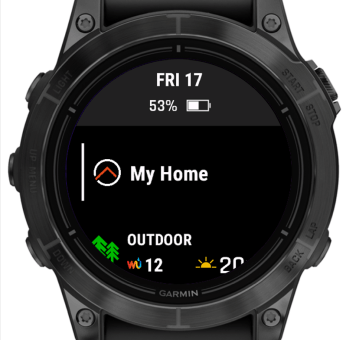</td>
    <td>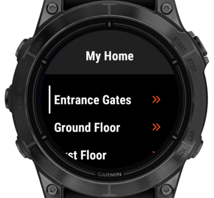</td>
  </tr>
</table>

Once opened, the **Widget** polls the sitemap at a configurable interval to fetch updates. Commands are sent to openHAB via its JSON-based REST API. If your openHAB setup does not support this API, you can alternatively configure a custom Webhook.

Inside the **Widget**, sitemap elements are displayed as **Sitemap Widgets**.
*Note: The term "widget" is used by both Garmin and openHAB to mean different things, which can be a source of confusion. In this manual, "Widget" refers to the Garmin app component, while "Sitemap Widget" refers to individual elements defined in the openHAB sitemap.*

The following sections provide detailed guidance on configuring the app, supported Sitemap Widgets, user interface behavior, and troubleshooting tips.

---

# Configuration

Once the app is installed, you can configure the following settings by opening it in the Garmin Connect IQ smartphone app.

| Setting             | Description |
|---------------------|-------------|
| **URL** | Your openHAB URL in the format `https://host:port` or `http://host:port`. Note: HTTP only works with iOS. See [Connectivity](#connectivity) and [Using myopenHAB](#-using-myopenhab) for details. |
| **Sitemap Name** | Name of the sitemap to display. See [Sitemap Setup](#-sitemap-setup) for details. | 
| **Native REST API Support** | Enable if your openHAB supports the new JSON-based REST API for sending commands. See [Sending Commands](#-sending-commands) for details. |
| **Webhook Identifier** | If your openHAB version doesn't support the JSON-based REST API (see above), you can configure a custom webhook to send commands. See [Custom Webhook](#custom-webhook) for details. |
| **Username** | For basic authentication (used for [myopenHAB](#-using-myopenhab), see below) |
| **Password** | Password for basic authentication |
| **Supress empty response errors** | Suppress errors for empty sitemap responses. Recommended when using myopenhab.org, which occasionally returns empty results. See the related [openhab-cloud issue #496](https://github.com/openhab/openhab-cloud/issues/496) for details. |
| **Polling Interval (ms)** | Interval between data requests to your openHAB instance. Set to 0 to fetch new data immediately after the previous response is processed. Polling only occurs while the app is open, not in the background. If you're using **myopenhab.org**, it's recommended to use the default (3000 ms) or a higher value to avoid overloading their servers. If you're connecting to your own openHAB server directly, you may try setting it to 0 for more responsive updates. |


---

## Connectivity

Garmin wearables rely on your smartphone for network access. If your phone can reach your openHAB instance (e.g. via local network or VPN like Tailscale), the watch can too.

**Platform-specific Limitations**
- **iOS**: HTTP and HTTPS supported  
- **Android**: Only HTTPS with a valid certificate is supported due to Garmin SDK limitations

You can use [myopenHAB](https://www.myopenhab.org) to securely access your local openHAB instance over the Internet using HTTPS.

---

## Using myopenHAB

To connect using [myopenHAB](https://myopenhab.org):

1. Install the [openHAB Cloud Connector](https://www.openhab.org/addons/integrations/openhabcloud/)
2. Register at [myopenhab.org](https://myopenhab.org)
3. Set the URL in the app to `https://home.myopenhab.org`
4. Use your myopenHAB username and password for authentication

---

## Sending Commands

Starting with openHAB 5, a built-in JSON-based REST API enables this app to send commands directly—no additional setup required.

For earlier versions (openHAB 4.x), you can either install a backported version of the API or configure a custom webhook.

### Option 1: Install the Backport

To enable JSON-based command support on openHAB 4.x, install the backported API bundle. Follow the instructions here:

➡️ [Backport Installation Guide](https://github.com/florian-h05/openhab-core/releases/tag/4.3.x-command-json)

### Option 2: Custom Webhook

If your openHAB setup does not support the JSON-based REST API for sending commands, you can configure a custom Webhook using the Webhook binding instead.

➡️ [Continue here](webhook.md) for setup instructions.

---

# Using the App

This section explains how to set up your openHAB sitemap for use with the app, outlines the supported Sitemap Widgets, and describes key aspects of the user interface.

---

## Sitemap Setup

Check the openHAB Sitemaps documentation to learn more about how sitemaps work.

➡️ [openHAB Sitemaps Documentation](https://www.openhab.org/docs/ui/sitemaps.html)

The sitemap name configured in the app must match the filename of the sitemap, excluding the `.sitemap` extension.

For example, if the file is named `garmin_demo.sitemap`, set the sitemap name in the app settings to `garmin_demo`.

The label defined within the sitemap file is displayed in the app UI, such as in glances and other views.

```xtend
sitemap garmin_demo label="My Home" {
}
```

---

### Supported Elements

The following element types are currently supported:

- [`Frame`](https://www.openhab.org/docs/ui/sitemaps.html#element-type-frame)

- [`Text`](https://www.openhab.org/docs/ui/sitemaps.html#element-type-text)

- [`Group`](https://www.openhab.org/docs/ui/sitemaps.html#element-type-group)

- [`Switch`](https://www.openhab.org/docs/ui/sitemaps.html#element-type-switch)

- [`Slider`](https://www.openhab.org/docs/ui/sitemaps.html#element-type-slider)

The following sections describe the supported parameters and the Sitemap Widget associated with each of these elements.

Here’s a revised and more concise version of your section with improved flow, grammar, and clarity:

#### Nested Elements

Nested elements are fully supported.

Certain sitemap elements — namely `Frame`, `Text`, and `Group` — can contain nested elements to help structure your sitemap hierarchically.

In openHAB, `Frame` elements are used to visually separate areas on a page, while nested elements under `Text` and `Group` are presented as navigable subpages. The Garmin app adopts a menu-based navigation structure and implements nested elements under all three types as submenus.

* For `Frame` and `Text`, nested elements must be defined manually. The only functional difference is that `Text` displays the associated item’s state, whereas `Frame` does not.
* `Group` elements automatically populate their nested elements based on the members of the referenced group item.

For more details, refer to the [openHAB documentation on nested elements](https://www.openhab.org/docs/ui/sitemaps.html#nested-elements).

---

### `Frame`

The [`Frame`](https://www.openhab.org/docs/ui/sitemaps.html#element-type-frame) element is [one of three](#nested-elements) sitemap elements that support hierarchical structuring.

You can nest `Frame` elements within other `Frame` elements. While this is allowed by the specification, openHAB may log a warning when doing so — but it still functions as expected.

Technically, the specification does *not* permit mixing `Frame` elements alongside other element types at the same hierarchy level. However, in practice, this does work in openHAB. If you choose to use this unsupported approach, be aware that you're doing so at your own risk.

Here is an example of a sitemap containing three `Frame` elements.

```openhab
sitemap garmin_demo label="My Home" {
	Frame label="Entrance Gates" {
		Switch item=EntranceGatesTrigger label="Open/Close" mappings=[OFF="", ON="OK"]
		Text item=EntranceGateStatus label="Status"
	}
	Frame label="Ground Floor" {
    // ...
	}
	Frame label="First Floor" {
    // ...
	}
}
```

This configuration produces the following display in the UI:

<table class="screenshot-table">
  <tr>
    <td width="50%"></td>
    <td></td>
  </tr>
</table>

---

### `Text`

The [`Text`](https://www.openhab.org/docs/ui/sitemaps.html#element-type-text) Sitemap Widget is used to display the current state of an item without allowing any user interaction.

**Supported parameters:**

* `label`: the label shown in the UI.
* `item`: the name of the openHAB item whose state should be displayed.

This widget is ideal for showing read-only information, such as temperature, system status, or sensor readings. It also supports [nested elements](#nested-elements), making it suitable for creating a hierarchical sitemap structure.

**Example configuration:**

In this example, the `Text` Sitemap Widget is used to display the status of entrance gates. Triggering the gates is handled by a separate `Switch` element.

```openhab
Frame label="Entrance Gates" {
  Switch item=EntranceGatesTrigger label="Open/Close" mappings=[OFF="GO", ON="DONE"]
  Text item=EntranceGateStatus label="Status"
}
```

**Resulting UI:**

<table class="screenshot-table">
  <tr>
    <td width="50%"></td>
    <td></td>
  </tr>
</table>

---

### `Group`

The [`Group`](https://www.openhab.org/docs/ui/sitemaps.html#element-type-group) Sitemap Widget will present a submenu containing all the items in the associated item of type `Group`. This also works recursively, if the `Group` item itself contains other `Group` items, those will again open their own submenus.

**Example configuration:**

In this example, the `Text` Sitemap Widget is used to display the status of entrance gates. Triggering the gates is handled by a separate `Switch` element.

```openhab
sitemap garmin_demo label="My Home" {
	Group item=CC_House_Lights label="All Lights"
  // ...
}
```

**Resulting UI:**

<table class="screenshot-table">
  <tr>
    <td width="50%">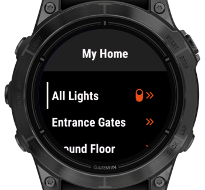</td>
    <td>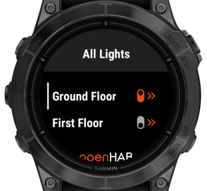</td>
  </tr>
  <tr>
    <td width="50%">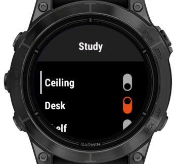</td>
    <td></td>
  </tr>
</table>

---

### `Switch`

The [`Switch`](https://www.openhab.org/docs/ui/sitemaps.html#element-type-switch) Sitemap Widget shows the current state of an item and allows the user to change it.  
It supports three variants:

1. **Toggle Switch** – for items that support `ON`/`OFF` commands.
2. **Rollershutter Control** – a full-screen view with `UP`, `DOWN`, and `STOP` buttons for rollershutter items.
3. **Generic Switch** – for items that accept other commands, as defined by mappings or the item's command descriptions.

**Supported parameters:**

- `label`: the label displayed in the UI.
- `item`: the name of the associated openHAB item.
- `mappings` (optional): used when commands other than `ON`/`OFF` should be sent.

If no `mappings` are provided, the widget will use the item's command and state descriptions, which may come from the underlying channel or be manually defined via metadata. Command descriptions are used to label both the current state and the available command options (if multiple exist). If state descriptions are present, they take precedence for labeling the current state only—not for the list of selectable commands.

If neither `mappings` nor command descriptions are available, the widget falls back to rendering a **toggle switch**, where selecting the item sends either an `ON` or `OFF` command.

If `mappings` are provided, the widget displays the current state as text:

- If the state matches one of the mapped commands, the corresponding label is shown.
- Otherwise, the raw state is displayed.

**Note:** The label defined in a sitemap mappings entry can be an empty string. This can be useful when the item supports only a single command and the label of the sitemap element already provides sufficient context.

**Selection behavior:**

* If **one** command is defined, it is sent immediately when the item is selected.
* If **two** commands are defined and one of them matches the current state, the **other** is sent immediately.
* In all other cases, an **action menu** appears on the right side of the screen, allowing the user to select from the list of available commands.
  If the current state matches one of the commands, that command is **not shown** in the menu.

#### Example configuration

```openhab
Frame label="Switches" {
    Switch item=Light label="Light"
    Switch item=Heating label="Heating" mappings=[ON="ACTIVE", OFF="INACTIVE"]
    Switch item=Rollershutter label="Shutters" mappings=[0="UP", STOP="STOP", 100="DOWN"]
}
```

In this example:

* **"Light"** will render as a toggle switch.
* **"Heating"** will display either `ACTIVE` or `INACTIVE`, depending on the current state.
* **"Shutters"** will show the current state and allow selection from the three commands (`UP`, `STOP`, `DOWN`).

**Resulting UI:**

<table class="screenshot-table">
  <tr>
    <td width="50%">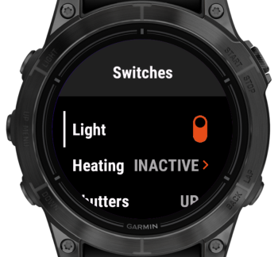</td>
    <td>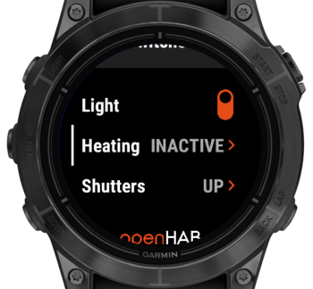</td>
  </tr>
  <tr>
    <td width="50%">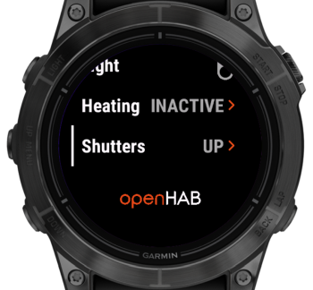</td>
    <td>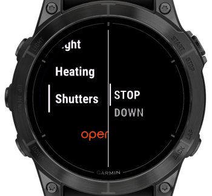</td>
  </tr>
</table>

**Notes:**

1. The orange arrow to the right of the state indicates that selecting the item will trigger a command.
2. The action menu shown in the lower-left screenshot is a **mockup**. The actual appearance may vary depending on the device, as it uses a native UI component.

#### Example with Empty Mapping Entry

Consider a garage door opener that acts as a toggle switch: sending an `ON` command triggers the gate to open or close, and the switch automatically resets to `OFF` after one second.

This can be configured in the sitemap like so:

```xtend
sitemap garmin_demo label="My Home" {
	Frame label="Entrance Gates" {
		Switch item=EntranceGates_Operation label="Open/Close" mappings=[OFF="", ON="OK"]
		Text item=EntranceGates_Status label="Status"
	}
}
```

In this configuration:

* The switch typically stays in the `OFF` state, where the `"Open/Close"` label is sufficient.
* When pressed, it sends the `ON` command, briefly displays `"OK"` as feedback, then returns to `OFF`.

Here’s how the interface appears when the switch is in the `OFF` state:

<table class="screenshot-table">
  <tr>
    <td width="50%">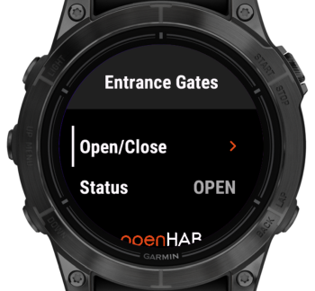</td>
    <td></td>
  </tr>
</table>

---

### `Slider`

The [`Slider`](https://www.openhab.org/docs/ui/sitemaps.html#element-type-slider) Sitemap Widget displays a numeric item state. When selected, it opens a full-screen view for picking a new value, which is then sent as a command.

**Supported parameters:**

- `label`: the label displayed in the UI.
- `item`: the name of the associated openHAB item.
- `minValue`: lower bound of the selectable range (default: `0`).
- `maxValue`: upper bound of the selectable range (default: `100`).
- `step`: interval between selectable values (default: `1`).
- `releaseOnly`: if set, the new value is only sent when the selection is confirmed. Otherwise, values are sent immediately while scrolling.

**Important note:**
While `step=1` is consistent with openHAB’s default, it often results in too many steps (e.g., 100 steps for a range of 0–100), which is impractical for wearable interfaces. Increasing `step` to `10` reduces the number of steps to 10, making interaction much more manageable.

**Example configuration:**

```openhab
Frame label="First Floor" {
  Slider item=Dimmer label="Dimmer" minValue=0 maxValue=100 step=10
  // ...
}
```

**Resulting UI:**

<table class="screenshot-table">
  <tr>
    <td width="50%">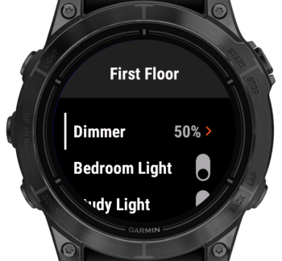</td>
    <td></td>
  </tr>
  <tr>
    <td width="50%">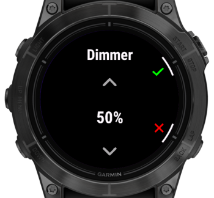</td>
    <td>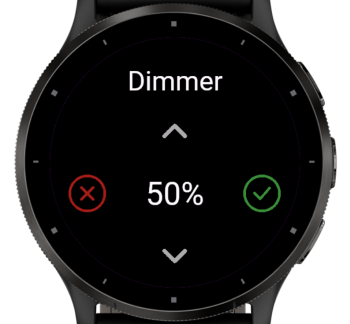</td>
  </tr>
</table>

- The **lower-left** screenshot shows the slider on a button-based device.
- The **lower-right** screenshot shows the slider on a touch-based device.

Note: Even button-based devices may support touch input, and on those, the UI reacts to both. On **button-based devices**, use **up/down** to scroll through the values, press **enter** (upper-right button) to confirm or **back** (lower-right button) to cancel. On **touch-based devices** simply **tap the icons** corresponding to the desired action or value to make a selection.

**Behavior of `releaseOnly`:**

* **With `releaseOnly`:** The value is only sent when the dialog is confirmed. Cancelling leaves the value unchanged.
* **Without `releaseOnly`:** Values are sent immediately as the slider is moved. Confirming keeps the current value; cancelling reverts to the value before the dialog was opened.

---

### Dynamic Sitemaps

Of the available [Dynamic Sitemaps](https://www.openhab.org/docs/ui/sitemaps.html#dynamic-sitemaps) features, the `visibility` parameter as well as label and icon colors are supported. 

#### Visibility

For usage details and examples, see the official [visibility documentation](https://www.openhab.org/docs/ui/sitemaps.html#visibility).

Here’s an improved version with clearer phrasing, smoother flow, and a slightly more polished tone, while preserving the original structure:

---

#### Label and Value Colors

For usage details and examples, refer to the official [openHAB documentation](https://www.openhab.org/docs/ui/sitemaps.html#label-value-and-icon-colors).

The app supports both `labelcolor` and `valuecolor` attributes. Color values can be specified using either hexadecimal color codes (e.g., `#FF0000`) or named colors (e.g., `red`) as listed in the documentation.

Here’s an example configuration:

```
sitemap garmin_demo label="My Home" {
	Frame label="Entrance Gates" {
		Switch item=Entrance_Gates_Power label="Open/Close" mappings=[OFF="", ON="DONE"]
		Text item=Entrance_Gates_Status label="Status" valuecolor=[==OPEN="red", ==CLOSED="green", ==MOVING="yellow"]
	}
}
```

This results in the following display:

<table class="screenshot-table">
  <tr>
    <td width="50%">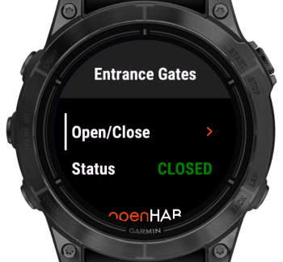</td>
    <td></td>
  </tr>
</table>

---

## Settings Menu

To access the settings menu:

* On button-based devices, scroll down on the home screen and continue past the ⚙️ icon.
* On touch-based devices, tap the ⚙️ **Settings** entry in the home screen menu.

The settings menu currently displays the app version and server URL. Additional features may be added in the future when the app evolves.

<table class="screenshot-table">
  <tr>
    <td width="50%">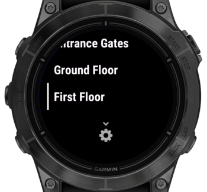</td>
    <td>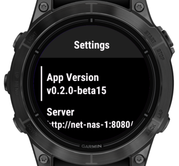</td>
  </tr>
</table>

---

## Troubleshooting

This section explains how the app handles errors and lists common issues you might encounter.

### How the App Handles Errors

The app distinguishes between **temporary (non-fatal)** and **critical (fatal)** errors:

* **Non-fatal errors** trigger a toast notification at the top of the screen, allowing you to continue using the app.
* **Fatal errors** display a full-screen error view, halting further use until the issue is resolved.

**Non-fatal errors include:**

* Most communication-related issues when requesting the sitemap.
* All communication-related issues when sending a command.

> Note: Non-fatal errors related to requesting the sitemap will become fatal if they persist for more than 10 seconds.

**Immediately fatal errors include:**

* Certain communication errors when requesting the sitemap, specifically:

  * Error `-1001` (see below)
  * HTTP error `404`
* Errors encountered while parsing the sitemap.
* Any other unexpected errors or exceptions.

> Note: Even after a fatal error, the app continues querying the sitemap. If a response is successfully processed, it returns to displaying the sitemap.

**If "Suppress Empty Response Errors" is enabled:**

When this option is enabled in the [Settings](#-configuration), toast notifications for the following errors will be suppressed:

* `INVRES` – Invalid response (error code `-400`)
* `EMRES` – Empty response

However, if these errors persist for more than 10 seconds, they will be treated as fatal, and a full-screen error view will be shown.

---

### Communication Error Codes

To save space, communication errors shown in toast notifications follow this format:

`X:NNNNNN`

* `X` indicates the source of the error:

  * `S` = sitemap polling
  * `C` = command sending
* `NNNNNN` is the error code:

  * Positive values = HTTP status codes
  * Negative values = Garmin SDK error codes

For a full list of Garmin SDK error codes, see the **Constant Summary** section here:
➡️ [Garmin Communications API Docs](https://developer.garmin.com/connect-iq/api-docs/Toybox/Communications.html)

**Special error codes:**

The following error codes are used for common communication issues and those without specific error codes:

* `NO PHONE` – The watch is not connected to the smartphone (error codes `-104` and `-2`).
* `INVRES` – The response was invalid (error code `-400`).
* `EMRES` – The response was empty.

---

### Common Issues

| Error | Description |
| ----- | ----------- |
| `S:EMRES/myopenHAB` | myopenHAB currently has an intermittent issue where sitemap requests may return empty responses. The app will show a non-fatal `S:EMRES` notification. Usually, the next request succeeds, preventing escalation to a fatal error. [More info](https://github.com/openhab/openhab-cloud/issues/496) |

---

# License

This app is distributed under the MIT License.

Copyright (c) 2025 Robert Pollai

Permission is hereby granted, free of charge, to any person obtaining a copy
of this software and associated documentation files (the "Software"), to deal
in the Software without restriction, including without limitation the rights
to use, copy, modify, merge, publish, distribute, sublicense, and/or sell
copies of the Software, and to permit persons to whom the Software is
furnished to do so, subject to the following conditions:

The above copyright notice and this permission notice shall be included in all
copies or substantial portions of the Software.

THE SOFTWARE IS PROVIDED "AS IS", WITHOUT WARRANTY OF ANY KIND, EXPRESS OR
IMPLIED, INCLUDING BUT NOT LIMITED TO THE WARRANTIES OF MERCHANTABILITY,
FITNESS FOR A PARTICULAR PURPOSE AND NONINFRINGEMENT. IN NO EVENT SHALL THE
AUTHORS OR COPYRIGHT HOLDERS BE LIABLE FOR ANY CLAIM, DAMAGES OR OTHER
LIABILITY, WHETHER IN AN ACTION OF CONTRACT, TORT OR OTHERWISE, ARISING FROM,
OUT OF OR IN CONNECTION WITH THE SOFTWARE OR THE USE OR OTHER DEALINGS IN THE
SOFTWARE.

---

# Icon Credits and Attributions

The in-app iconography is attributed to the following sources:


[Lightbulb](https://thenounproject.com/icon/lightbulb-3194358/) by [Adrien Coquet](https://adrien-coquet.com/) from [Noun Project](https://thenounproject.com/browse/icons/term/lightbulb/) (CC BY 3.0)

---


[Folder](https://thenounproject.com/icon/folder-1637828/) by [Adrien Coquet](https://adrien-coquet.com/) from [Noun Project](https://thenounproject.com/browse/icons/term/folder/) (CC BY 3.0)

---


[Settings](https://thenounproject.com/icon/settings-1939978/) by [Adrien Coquet](https://adrien-coquet.com/) from [Noun Project](https://thenounproject.com/browse/icons/term/down/) (CC BY 3.0)

---


Derived from:

[Down](https://thenounproject.com/icon/down-1896670/) by [Adrien Coquet](https://adrien-coquet.com/) from [Noun Project](https://thenounproject.com/browse/icons/term/down/) (CC BY 3.0)

[Settings](https://thenounproject.com/icon/settings-1939978/) by [Adrien Coquet](https://adrien-coquet.com/) from [Noun Project](https://thenounproject.com/browse/icons/term/down/) (CC BY 3.0)

---


Derived from:

[Chevron](https://thenounproject.com/icon/up-2587304/) by [Adrien Coquet](https://adrien-coquet.com/) from [Noun Project](https://thenounproject.com/browse/icons/term/chevron/) (CC BY 3.0)

---


[Check](https://thenounproject.com/icon/check-1896702/) by [Adrien Coquet](https://adrien-coquet.com/) from [Noun Project](https://thenounproject.com/browse/icons/term/check/) (CC BY 3.0)

---


[Cancel](https://thenounproject.com/icon/clear-2801731/) by [Adrien Coquet](https://adrien-coquet.com/) from [Noun Project](https://thenounproject.com/browse/icons/term/cancel/) (CC BY 3.0)

---


[Stop](https://thenounproject.com/icon/stop-1939990/) by [Adrien Coquet](https://adrien-coquet.com/) from [Noun Project](https://thenounproject.com/browse/icons/term/stop/) (CC BY 3.0)

---


[Stop Hint](https://thenounproject.com/icon/stop-1939970/) by [Adrien Coquet](https://adrien-coquet.com/) from [Noun Project](https://thenounproject.com/browse/icons/term/stop/) (CC BY 3.0)
